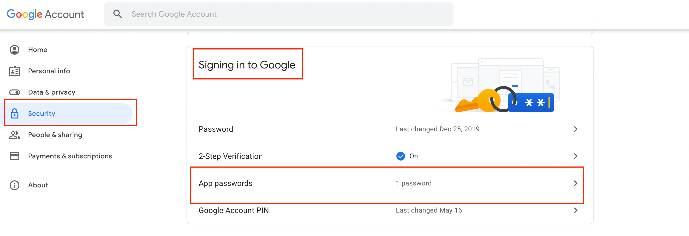
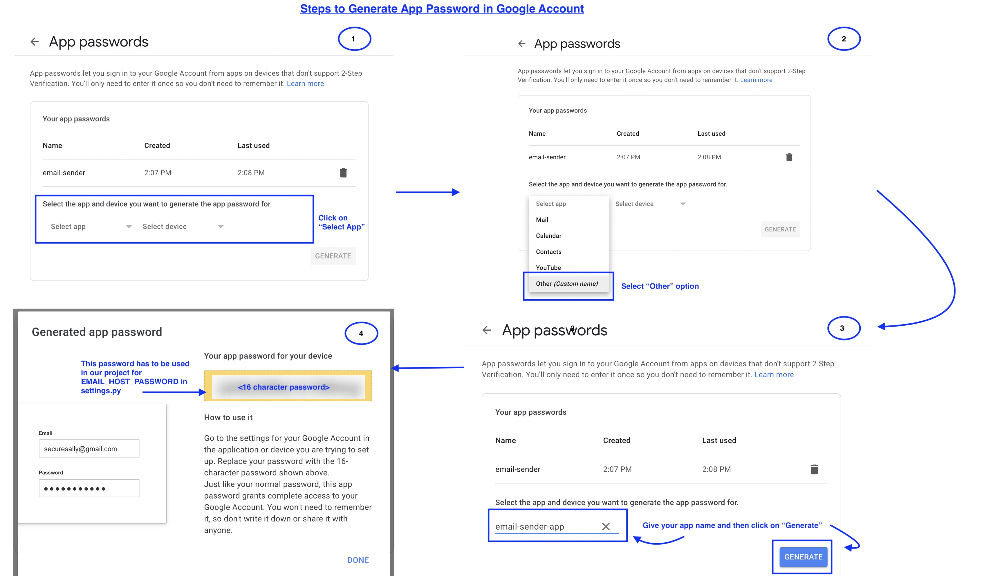

# Django-Email-Sender
Send email from Gmail Id in Django using HTML Template

## Pre-Requisites
- Python 3.8
- Pip
- Git

## Steps to run:

- Clone the project using the command **git clone https://github.com/sukanya-pai/Django-Email-Sender.git**

- In PipFile, the dependencies are mentioned. It is recommended to run the app inside a virtual environment to avoid conflict of existing dependencies.

  - Run the command `pip install pipenv`

  - Run `pipenv shell`. Creates virtual env

  - Run `pipenv install`. Installs dependencies from the PipFile and creates PipFile.lock

  - Run `python email_project/manage.py runserver` to start the server

  - Open [http://127.0.0.1:8000/api/send-mail](http://127.0.0.1:8000/api/send-mail) to start

- Make changes in the **views.py** file of the **email_sender_app** directory inside the `send_mail()` method to add your *mail address* and the *recipients mail address* accordingly.

- Make changes in the **settings.py** of the **email_project** directory file with your **gmail id** and **your app password**. 

  - Since this is a demo project, the password is written directly in settings.py. For security reasons of your account, it is recommended you store the password in key vault or encrypt it and then host the application or push your changes to GitHub.

- Read [change log](change.log) to see what has changed.

## Mandatory changes to be done in Host Gmail account
- Go to https://myaccount.google.com/security

- Scroll till you find **Signing in to Google**

  - In that section, you will see the "App Passwords" option as shown in the below image.

  

  - When you click on **App Passwords**, you will be asked to enter your Gmail account password. Enter it and the page would open:

  - Follow the below steps as shown in the image to setup your app password.

  

- Only if you follow the above steps, then you can send mail from your Gmail account using your django code. 
